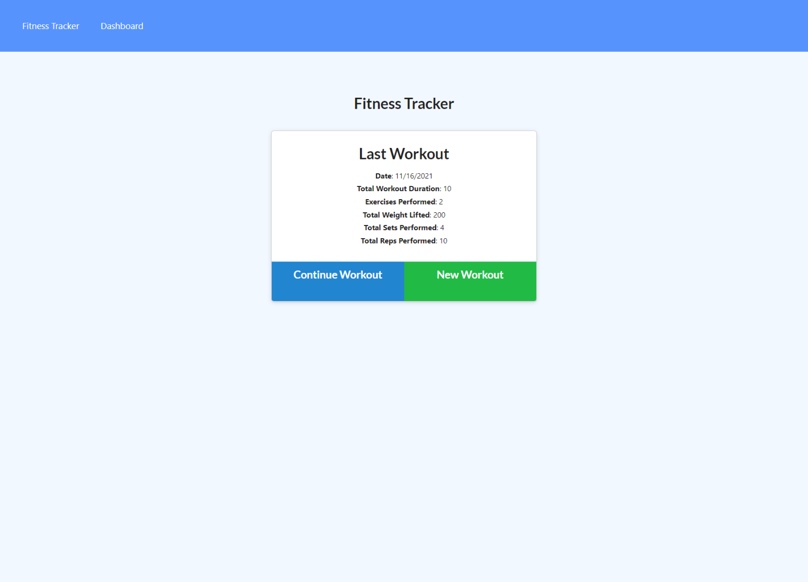
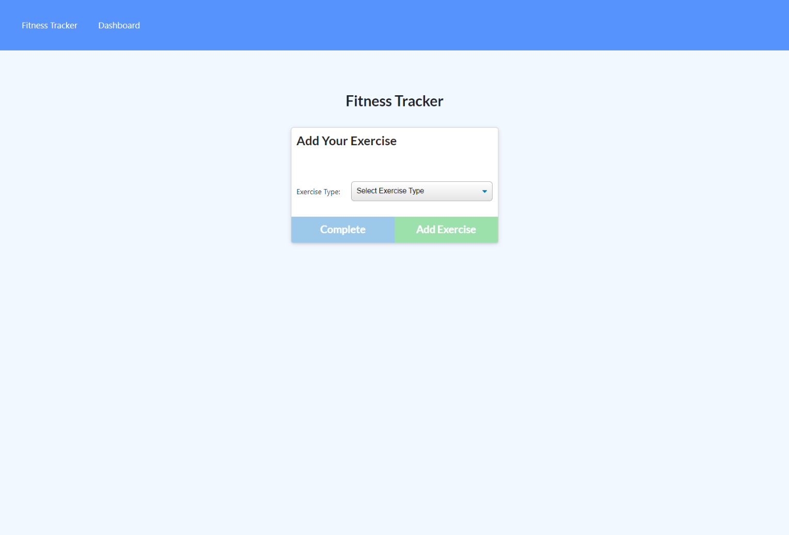
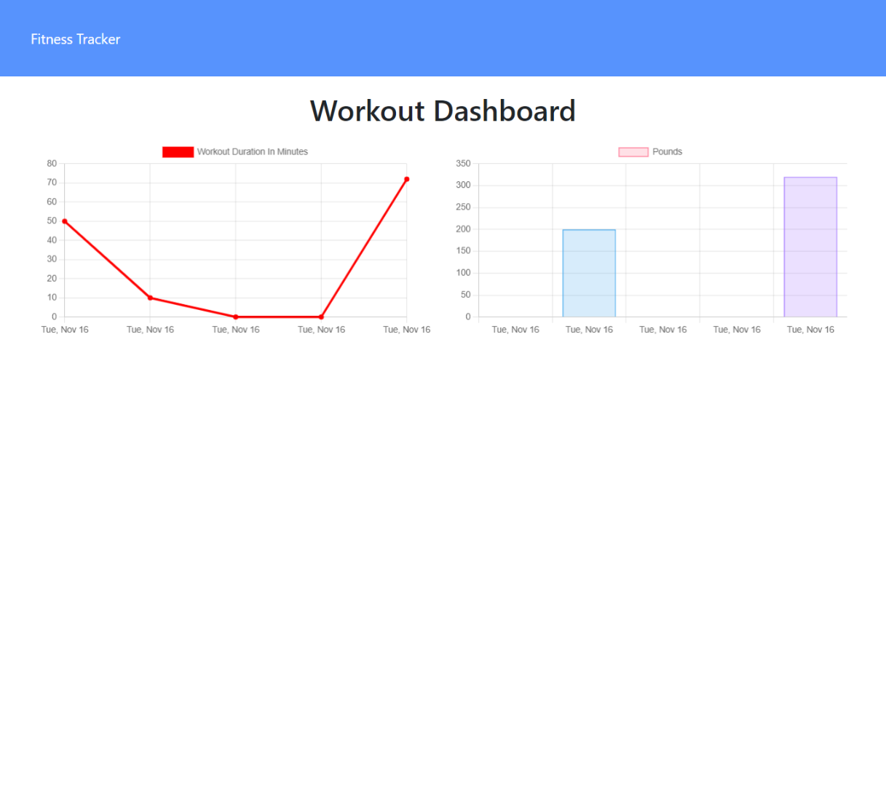

# Fitness-Tracker

## Table Contents

- [Description](#Description)
- [Github Repository](#GithubRepository)
- [Link to the App](#App)
- [Screenshots](#Screenshots)
- [Contributors](#Contributors)
- [Questions](#Questions)

## Description

As a user, I want to be able to view create and track daily workouts. I want to be able to log multiple exercises in a workout on a given day. I should also be able to track the name, type, weight, sets, reps, and duration of exercise. If the exercise is a cardio exercise, I should be able to track my distance traveled.

## Github Repository

The link to the demo can be found [Repository](https://github.com/romzzp/Fitness-Tracker).

## App

The link to the app can be found [App](https://rj-fitness-tracker.herokuapp.com/?id=61936d77250a4600165f98f5).

## Screenshots

The landing page

Workout adding page

Dashboard page

## Questions

If you have any questions regarding the application you can reach me at [github](https://github.com/romzzp) or at my [email](romzz.patel@gmail.com).
